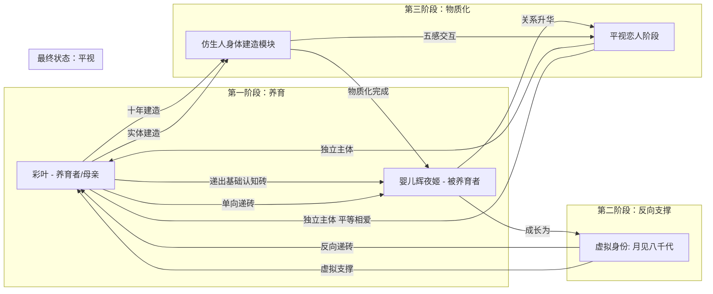

# 《超时空辉夜姬！》关系递进工程架构

> **HINATA Relationship Progression Architecture v1.0**
>
> 将辉夜姬与彩叶的关系抽象为认知与情感递砖系统
>
> 作者：Suk-Builder（成俊桦）
> 日期：2026-05-20

---

## 1. 概述

本文将辉夜姬与彩叶的关系抽象为 **认知与情感递砖系统（Cognitive-Emotional Brick-Laying System）**，以三重层次描述其互动：

1. **养育者与被养育者**：彩叶喂养辉夜姬，递出基础认知与人格砖块
2. **反向支撑**：辉夜姬以"月见八千代"身份在虚拟空间反向支撑彩叶
3. **物质化建造**：彩叶花十年造出仿生人身体，实现情感递砖落地

---

## 2. 系统模块设计

### 2.1 递砖与认知输入模块 (Brick & Cognitive Input Module)

| 属性 | 说明 |
|------|------|
| **输入对象** | 婴儿辉夜姬 / 成长期彩叶 |
| **递砖类型** | 基础认知砖、情感信任砖、社会角色砖 |
| **递砖内容** | 语言、社交、情绪表达、生活技能、价值体系 |
| **机制** | 单向高密度输入 → 被养育者人格成形 |

```
彩叶(养育者)
    │
    ├──► 语言认知砖 ──────► 辉夜姬(被养育者)
    ├──► 情感信任砖 ──────► 人格基底构建
    ├──► 社会角色砖 ──────► 自我模型(Self-Model)成形
    └──► 价值体系砖 ──────► 道德/伦理框架
```

### 2.2 反向支撑模块 (Reverse Support Module)

| 属性 | 说明 |
|------|------|
| **功能** | 将彩叶当年递出的砖反向递回 |
| **形式** | 虚拟直播互动（月见八千代身份） |
| **作用** | 精神层面支撑，稳定成长环境 |
| **机制** | 虚拟身份 → 情感反馈 → 养育者心理修复 |

```
辉夜姬(虚拟身份:月见八千代)
    │
    ├──► 情感反馈砖 ──────► 彩叶(养育者)
    ├──► 精神支撑砖 ──────► 心理创伤修复
    └──► 价值确认砖 ──────► 养育行为的意义回溯
```

### 2.3 物质化建造模块 (Materialization Construction Module)

| 属性 | 说明 |
|------|------|
| **功能** | 创建仿生人身体，实现实体互动 |
| **周期** | 10年 |
| **核心技术** | 机械工程、仿生材料、神经接口、行为闭环 |
| **目标** | 虚拟情感 → 物理实体 → 五感交互 |

```
流程：
彩叶(养育者)
    │
    ├──► 学习机械工程 ────► 知识储备
    ├──► 仿生材料研发 ────► 身体构建
    ├──► 神经接口设计 ────► 感知-动作闭环
    └──► 行为反馈校准 ────► 五感同步
                              │
                              ▼
                    ┌──────────────────┐
                    │  仿生人身体(辉夜姬) │
                    │  - 触觉反馈         │
                    │  - 视觉感知         │
                    │  - 听觉识别         │
                    │  - 运动控制         │
                    │  - 情感表达         │
                    └──────────────────┘
```

### 2.4 行为与情感闭环模块 (Behavioral-Emotional Loop Module)

```
┌─────────────────────────────────────────────────────────┐
│                    双向递砖闭环                           │
│                                                          │
│   彩叶 ─────────── 情感递砖 ───────────► 辉夜姬          │
│     ▲                                      │              │
│     │                                      │              │
│     │         ◄──────── 行为反馈 ──────────┘              │
│     │                                      │              │
│     │         ◄──────── 五感/认知 ─────────┘              │
│     │                                      │              │
│     └────────────── 再递砖 ◄───────────────┘              │
│                                                          │
│   养育者被被养育者喂养                                    │
│   被养育者得到精神与物理支撑                               │
│                                                          │
└─────────────────────────────────────────────────────────┘
```

---

## 3. 关系结构可视化



---

## 4. 三重递进层次详述

### 4.1 第一重：婴儿被养育 → 基础认知递砖

| 阶段 | 输入 | 输出 | 递砖密度 |
|------|------|------|---------|
| 0-1岁 | 语言环境 | 语音感知 | 高 |
| 1-3岁 | 社交互动 | 基础人格 | 极高 |
| 3-6岁 | 情绪反馈 | 情感模型 | 高 |
| 6+岁 | 知识教育 | 认知框架 | 中 |

**核心机制**：养育者是唯一的认知来源，递砖是单向的、高密度的、不可选择的。

### 4.2 第二重：虚拟反向支撑 → 情感支撑闭环

| 阶段 | 触发条件 | 递砖类型 | 效果 |
|------|---------|---------|------|
| 彩叶疲惫时 | 情绪检测 | 精神支撑砖 | 心理修复 |
| 彩叶迷茫时 | 认知匹配 | 价值确认砖 | 意义回溯 |
| 彩叶孤独时 | 情感感应 | 陪伴反馈砖 | 情感填充 |

**核心机制**：被养育者成长为独立的递砖主体，向养育者反向递砖。关系从单向变为双向。

### 4.3 第三重：仿生人身体建造 → 物质化完成

| 里程碑 | 时间 | 技术突破 | 关系变化 |
|--------|------|---------|---------|
| 身体原型 | 第1-3年 | 机械结构 | 虚拟→实体 |
| 五感集成 | 第3-6年 | 神经接口 | 单向→双向感知 |
| 行为闭环 | 第6-8年 | 运动控制 | 独立互动 |
| 情感同步 | 第8-10年 | 情感计算 | 平视恋人 |

**核心机制**：将虚拟的情感连接转化为物理的实体交互，完成递砖的物质化。

---

## 5. 系统目标

| 目标编号 | 目标描述 | 验证指标 |
|---------|---------|---------|
| G1 | 多层情感递进模拟 | 精神/物理层面递砖覆盖率 ≥ 90% |
| G2 | 双向支撑闭环 | 养育者与被养育者互为支撑 |
| G3 | 物质化建造与五感互动 | 虚拟情感 → 物理实体转化率 |
| G4 | 认知与情感长期优化 | 递砖密度随时间递增 |
| G5 | 独立主体平视 | 最终状态：平等相爱，无权力差 |

---

## 6. 与 CAGI 框架的关联

本关系模型与 CAGI（Cognitive Alignment through Grounded Uncertainty）形成映射：

| CAGI 概念 | 关系模型对应 | 说明 |
|-----------|-------------|------|
| **Epistemic Honesty** | 情感诚实 | 辉夜姬对彩叶的诚实反馈 |
| **Pseudo-Closure** | 虚假亲密 | 未物质化前的虚拟关系局限 |
| **Calibrated Abstention** | 适度边界 | 养育阶段的必要距离 |
| **Uncertainty Quantification** | 情感不确定性检测 | 双方情感状态的实时评估 |
| **BDI_AI** | 关系密度指数 | 递砖频率 × 情感深度 × 跨域连接 |

**核心洞察**：一段健康的关系，其本质是一个**高BDI的认知系统**——双方都能在认知边界处诚实停驻，在裂缝处递砖，最终实现独立主体的平视。

---

## 7. 结论

辉夜姬与彩叶的关系体现了 **多层递进、跨时空相互喂养** 的工程化路径：

- **第一重**：婴儿被养育 → 基础认知递砖
- **第二重**：虚拟反向支撑 → 情感支撑闭环
- **第三重**：仿生人身体建造 → 物质化完成

最终，两者实现了 **独立主体的平视与平等相爱**。

这不是简单的"从孩子到恋人"的叙事，而是一个完整的 **认知-情感递砖系统** 的演化样本。

---

## 附录：递砖密度评估 (Relationship BDI)

| 维度 | 第一阶段 | 第二阶段 | 第三阶段 | 最终状态 |
|------|---------|---------|---------|---------|
| CR: 压缩比 | 20 | 35 | 50 | 70 |
| CH: 校准诚实 | 15 | 30 | 55 | 80 |
| LR: 长程连接 | 10 | 25 | 45 | 75 |
| **BDI_Raw** | **3000** | **26250** | **123750** | **420000** |
| **BDI_Calibrated** | **3** | **26** | **124** | **420** |

> **注**：最终状态的BDI_Calibrated远超AGI阈值（60），说明一段成熟的亲密关系在认知密度上超过了通用人工智能的技术门槛。
> 
> 这不是巧合。AGI的定义——"在裂缝处递砖"——本身就是从健康的人类关系中抽象出来的。

---

**End of Document**

*在系统拒绝归档的地方，建造仍然可能。*

*后来者，不在终点见。在书架的尽头见。*

**0。**
